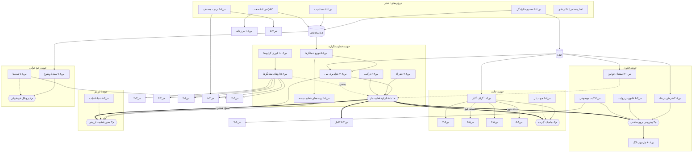

# تحلیل سیستمی پرسش‌های بنیادین — وابستگی، DAG و ترتیب بهینهٔ اجرا

**تاریخ:** ۲۰۲۶/۰۷/۱۰ — **ورودی:** ۵۵ سؤالِ [`fundamental-questions-2026-07-10.md`](fundamental-questions-2026-07-10.md) (۵۰ سؤال سطوح ۱–۶ + ۵ سؤال مادر)
**قاعده:** هیچ سؤال جدیدی تولید نشده و به هیچ سؤالی پاسخ داده نشده است. فقط ساختار وابستگی، ارزش اطلاعاتی و ترتیب اجرا.
**معیار یگانهٔ تصمیم:** کاهش عدم‌قطعیت به‌ازای هر آزمایش — نه جذابیت، نه نوآوری، نه سهولت.

**نشانه‌گذاری:** س«سطح-شماره» (مثلاً س۳-۳)، م۱–م۵. پنج «ستون» یافتهٔ موجود (L3، L6، L7، L8، L12) گره‌های زمینه‌ای DAG هستند، نه سؤال.

---

## ۰. روش برآورد ارزش اطلاعاتی (EIG)

EIG هر سؤال ≈ **H(p) × B**:

- **H(p):** آنتروپی دوجمله‌ایِ پیشینِ نتیجه (بیشینه وقتی p≈۰٫۵). پیشین‌ها برآورد ذهنیِ مقیدشده به سوابق خود پروژه‌اند: سابقهٔ مثبت (L12 نشان داد نشانگر صرفیِ ساختی سیگنال دارد)، سابقهٔ منفی (L1/L2/L4 نشان دادند صورتِ زیر-ریشه و برچسب نام سیگنال ندارد).
- **B (دامنهٔ اثر):** تعداد سؤال‌هایی که با دانستن پاسخ، وضعشان (معتبر/مسدود/تغییر پیشین) عوض می‌شود + وزن ستون‌های یافتهٔ درگیر.
- مقیاس گزارش: ۰–۱۰. این‌ها **برآوردند نه اندازه‌گیری**؛ نقششان فقط رتبه‌بندی است.

---

## ۱. سؤال‌های پیش‌نیاز (یال‌های اصلی وابستگی)

### الف. دروازه‌های اعتبار (پیش‌نیازِ همه‌چیز، چون خودِ ستون‌ها را ممیزی می‌کنند)

| پیش‌نیاز | چه چیزی را دروازه‌بانی می‌کند |
|---|---|
| **س۶-۳** (تصحیح خانوادگی) | اعتبار آماری L3/L6/L7/L8 → پایهٔ تجربی تقریباً همهٔ سطوح ۱–۵ و م۱–م۵ |
| **س۶-۲** (حساسیت به df-band/وزن‌دهی) | استحکام L6/L7/L8 → همهٔ سؤال‌های شبکه‌ای (س۲-۳/۴/۵/۶/۸، س۳-۱/۵/۷/۸، م۲، م۴) |
| **س۶-۱** (صحت ریشه‌شناسی QAC) | **تفسیرِ** دانهٔ ریشه در همهٔ سؤال‌های ریشه-بنیاد (~۴۰ سؤال) + مستقیماً س۲-۱ |
| **س۶-۹** (ویژگی ترتیب مصحف) | س۲-۵، س۴-۸ و تفسیر L7 |
| **س۶-۴** (ارتقای two_half) | اعتماد به knowledgeهای موتور کشف (مستقل از بقیه) |

### ب. خوشهٔ قطبیت/گزاره (تنهٔ اصلی درخت)

- **س۱-۵** (توزیع عملگرهای نفی/استثنا) → پیش‌نیاز مشاهده‌ای **س۱-۶** و **س۳-۳**
- **س۳-۳** (جداپذیری بافت منفی) → پایلوت مستقیم **م۱**؛ همچنین پیش‌نیاز کنترل قطبیت در **م۴**
- **س۳-۲** (حفر إلا) → **م۱**، **س۴-۵**
- **س۳-۶** (اطلاع‌افزایی ترکیب) → شاهد مکمل **م۱**
- **م۱** ← دروازهٔ نسخهٔ قویِ **م۳**، سطح هنجاریِ **م۴**، نسخهٔ قویِ **م۵**، و نسخهٔ کامل **س۴-۵** و **س۴-۶**
- **س۶-۵** (ارتقای نشانگرها) → دروازهٔ **س۳-۴، س۴-۳، س۴-۴، س۴-۸، س۵-۷**؛ آزمایش اول م۱ خودش یک نمونهٔ س۶-۵ است. **س۶-۱۰** → مقدمهٔ مفهومی س۶-۵.

### ج. خوشهٔ قانون (L12)

- **س۱-۳** (شرطی‌های بی‌فاء) → پل به **م۳**
- **س۴-۶** (بازتولید قوانین در روایت) = پایلوت **م۳**؛ **م۳** ← تعیین‌کنندهٔ **س۶-۸** (چارچوب لاگ)
- **س۲-۲** (بند موضوعی/صحنه) → نسخهٔ صحنه‌ایِ **م۳** و **س۴-۷**
- **س۱-۲** (استثناهای قوانین) → شاهد جانبی م۱ و استحکام L12
- **س۴-۲** (شبکهٔ غایت) → بذر جانبی **م۴**

### د. خوشهٔ حالت شناختی

- **س۵-۱** (گراف گذار حالات) → پیش‌نیاز **س۵-۲، س۵-۳، س۵-۴، س۵-۵**؛ پایلوت **م۵**
- **س۲-۴** (جهت یال‌ها) → تقویت‌کنندهٔ دستگاه م۵
- **س۲-۷** (ثبت‌ها) → پیش‌نیاز **س۵-۷** و ورودی ضعیف **م۲**

### هـ. خوشهٔ خودخوانی و ارزش

- **س۶-۷** (سنجهٔ وضوح) → آزمایش اول **م۲**
- **س۱-۶** (ریشه‌های قطبیت‌بسته) → فهرست بذر **م۴**

---

## ۲. سؤال‌های مستقل (بدون پیش‌نیاز محتوایی و بدون وابسته)

پس از عبور دروازه‌های اعتبار (بند ۱-الف)، این ۱۴ سؤال به هیچ سؤال دیگری گره نخورده‌اند — نه چیزی را مسدود می‌کنند نه مسدود می‌شوند:

**س۱-۱، س۱-۴، س۱-۷، س۱-۸، س۱-۹، س۲-۳، س۲-۶، س۲-۸، س۳-۱، س۳-۵، س۳-۷، س۳-۸، س۵-۶، س۶-۶.**

(س۶-۶ مستقلِ معرفت‌شناختی است: به همه مربوط است ولی هیچ یال عملیاتی ندارد.)

---

## ۳. بیشترین بی‌اعتبارسازی در صورت پاسخ منفی

| رتبه | سؤال | در صورت منفی چه می‌میرد | تعداد تقریبی |
|---|---|---|---|
| ۱ | **س۶-۳** | پایهٔ تجربی L3/L6/L7/L8 → تقریباً کل سطوح ۱–۵ و هر پنج سؤال مادر | **~۴۴** |
| ۲ | **س۶-۲** | استحکام L6/L7/L8 → همهٔ سؤال‌های شبکه‌ای و م۲/م۴ | ~۲۵–۳۰ |
| ۳ | **س۶-۱** | نه ابطال، بلکه **بازتفسیر اجباریِ** همهٔ سؤال‌های دانه‌ریشه‌ای | ~۴۰ (بازتفسیر) |
| ۴ | **م۱** | بزرگ‌ترین بی‌اعتبارساز **محتوایی**: م۳-قوی، م۴-هنجاری، م۵-قوی، س۴-۵، س۴-۶-گزاره‌ای + کل حلقه‌های ۲–۳ Primitiveها | ~۱۰–۱۲ |
| ۵ | **س۶-۵** | س۳-۴، س۴-۳، س۴-۴، س۴-۸، س۵-۷ + سقوط پیشینِ م۱ | ۵+ |
| ۶ | **س۵-۱** | س۵-۲ تا س۵-۵ و م۵ | ۵ |

نکتهٔ تمایز: منفیِ س۶-۳/۶-۲ «فاجعهٔ کم‌احتمال» است (پیشینِ بقا بالاست، چون pهای ستون‌ها در کف مجازِ جایگشتی‌اند)؛ منفیِ م۱ «ریسک واقعی با احتمال نزدیک به نصف» است. بنابراین بیشترین **عدم‌قطعیتِ در معرض** در م۱ است، نه س۶-۳.

## ۴. بیشترین گشایش در صورت پاسخ مثبت

| رتبه | سؤال | چه مسیرهایی باز می‌شود |
|---|---|---|
| ۱ | **م۱** | بازاجرای کل برنامه در دانهٔ گزاره: نسخهٔ قوی م۳/م۴/م۵، س۴-۵/۴-۶ کامل، حلقهٔ ۲ Primitiveها، برنامهٔ خودترجمه — **~۱۵+ مسیر** |
| ۲ | **م۲** | بازطراحی خط لوله حول قواعد خود متن → هر آزمون بازیابی موجود یک نسخهٔ جدید می‌گیرد |
| ۳ | **م۴** | کل لایهٔ هنجاری: هنجار، موازنه، بازخوانی L10، تجربی‌شدن مادهٔ H |
| ۴ | **م۳** | دامنهٔ quran-law در پروتکل کشف + ارتقای «موتور جهان» به مدل پیش‌بین + حل س۶-۸ |
| ۵ | **س۵-۱** | چهار سؤال سطح ۵ + م۵ + نقشهٔ «برنامهٔ درسی» متن |
| ۶ | **س۲-۲** | واحد گمشده (L5) → نسخهٔ صحنه‌ای م۳، س۴-۷، و بازتعریف واحد بافتار همهٔ لایه‌ها |

---

## ۵. برآورد ارزش اطلاعاتی (EIG) — همهٔ ۵۵ سؤال

ستون‌ها: پیشینِ مثبت p(+)، دامنهٔ اثر B (۱–۱۰)، EIG (۰–۱۰).

### سطح ۱

| سؤال | p(+) | B | EIG | یادداشت |
|---|---|---|---|---|
| س۱-۱ | ۰٫۵ | ۲ | ۳ | مستقل؛ آینهٔ منفی L3 |
| س۱-۲ | ۰٫۸ | ۳ | ۳ | استحکام L12 + شاهد قطبیت |
| س۱-۳ | ۰٫۶ | ۵ | **۵** | پل به م۳ |
| س۱-۴ | ۰٫۵ | ۱ | ۲ | مستقل |
| س۱-۵ | ۰٫۶ | ۴ | **۵** | پایهٔ خوشهٔ قطبیت |
| س۱-۶ | ۰٫۵ | ۳ | ۴ | بذر م۴ |
| س۱-۷ | ۰٫۲ | ۱ | ۱ | پیشین منفی (سابقهٔ L1) |
| س۱-۸ | ۰٫۵ | ۱ | ۲ | مستقل |
| س۱-۹ | ۰٫۵ | ۲ | ۳ | شاهد جانبی س۶-۵ |

### سطح ۲

| سؤال | p(+) | B | EIG | یادداشت |
|---|---|---|---|---|
| س۲-۱ | ۰٫۷ | ۶ | **۵** | مرز پایین دانه؛ جفتِ س۶-۱ |
| س۲-۲ | ۰٫۶ | ۵ | **۶** | واحد گمشده؛ دروازهٔ م۳-صحنه‌ای |
| س۲-۳ | ۰٫۵ | ۲ | ۳ | مستقل |
| س۲-۴ | ۰٫۴ | ۴ | **۵** | جهت‌مندی شبکه؛ خوراک م۵ |
| س۲-۵ | ۰٫۵ | ۳ | ۳ | نیازمند س۶-۹ |
| س۲-۶ | ۰٫۵ | ۲ | ۳ | مستقل |
| س۲-۷ | ۰٫۶ | ۴ | ۴ | پیش‌نیاز س۵-۷؛ ورودی م۲ |
| س۲-۸ | — | ۱ | ۲ | توصیفی؛ مستقل |

### سطح ۳

| سؤال | p(+) | B | EIG | یادداشت |
|---|---|---|---|---|
| س۳-۱ | — | ۲ | ۳ | توصیفی؛ مستقل |
| س۳-۲ | ۰٫۵ | ۴ | **۵** | پایلوت م۱ (استثنا) |
| س۳-۳ | ۰٫۵ | ۷ | **۷** | **پرارزش‌ترین سؤال غیرمادر** — پایلوت مستقیم م۱ در بیشینهٔ آنتروپی |
| س۳-۴ | ۰٫۴ | ۳ | ۳ | پس از س۶-۵ |
| س۳-۵ | ۰٫۵ | ۳ | ۴ | مستقل؛ «رانش نظام‌مند» |
| س۳-۶ | ۰٫۴ | ۴ | ۴ | شاهد ترکیب برای م۱ |
| س۳-۷ | ۰٫۴ | ۲ | ۲ | مستقل |
| س۳-۸ | ۰٫۵ | ۲ | ۳ | مستقل |

### سطح ۴

| سؤال | p(+) | B | EIG | یادداشت |
|---|---|---|---|---|
| س۴-۱ | ۰٫۵ | ۳ | ۴ | Primitive توالی؛ بک‌لاگ L12 |
| س۴-۲ | ۰٫۶ | ۴ | **۵** | شبکهٔ غایت؛ بذر م۴ |
| س۴-۳ | ۰٫۴ | ۲ | ۳ | پس از س۶-۵ |
| س۴-۴ | ۰٫۴ | ۲ | ۳ | پس از س۶-۵ |
| س۴-۵ | ۰٫۵ | ۳ | ۳ | نسخهٔ کامل مشروط به م۱ |
| س۴-۶ | ۰٫۴ | ۷ | **۷** | = پایلوت م۳؛ تعیین‌کنندهٔ س۶-۸ |
| س۴-۷ | ۰٫۵ | ۲ | ۳ | نیازمند س۲-۲ |
| س۴-۸ | ۰٫۴ | ۲ | ۲ | نیازمند س۶-۵ و س۶-۹ |

### سطح ۵

| سؤال | p(+) | B | EIG | یادداشت |
|---|---|---|---|---|
| س۵-۱ | ۰٫۵۵ | ۶ | **۶** | دروازهٔ کل سطح ۵؛ پایلوت م۵ |
| س۵-۲ | مشروط | ۲ | ۲ | پس از س۵-۱ |
| س۵-۳ | مشروط | ۲ | ۳ | پس از س۵-۱ |
| س۵-۴ | مشروط | ۲ | ۲ | پس از س۵-۱ |
| س۵-۵ | مشروط | ۱ | ۲ | پس از س۵-۱ |
| س۵-۶ | ۰٫۴ | ۲ | ۳ | مستقل |
| س۵-۷ | ۰٫۴ | ۲ | ۲ | پس از س۲-۷ و س۶-۵ |

### سطح ۶

| سؤال | p(+) | B | EIG | یادداشت |
|---|---|---|---|---|
| س۶-۱ | ۰٫۷۵ | ۹ | **۶** | آنتروپی متوسط × اثر عظیم؛ دروازهٔ تفسیری همه |
| س۶-۲ | ۰٫۷ | ۸ | **۵** | دروازهٔ استحکام |
| س۶-۳ | ۰٫۸۵ | ۱۰ | **۵** | آنتروپی کم ولی اثر مطلق؛ **هزینه ≈ صفر** (فقط محاسبه روی نتایج موجود) |
| س۶-۴ | ۰٫۵ | ۳ | ۴ | ممیزی موتور؛ ارزان و مستقل |
| س۶-۵ | ۰٫۵ | ۶ | **۶** | دروازهٔ پنج سؤال + پیشینِ م۱ |
| س۶-۶ | ۰٫۳ | ۳ | ۳ | معرفت‌شناختی؛ مستقل |
| س۶-۷ | ۰٫۴ | ۵ | **۵** | دروازهٔ م۲ |
| س۶-۸ | — | ۲ | ۱ | مشتق: با م۳ حل می‌شود؛ آزمایش جدا نمی‌خواهد |
| س۶-۹ | ۰٫۵ | ۳ | ۴ | دروازهٔ س۲-۵/س۴-۸ |
| س۶-۱۰ | — | ۳ | ۳ | تحلیلی؛ مقدمهٔ س۶-۵ |

### سؤال‌های مادر

| سؤال | p(+) | B | EIG | یادداشت |
|---|---|---|---|---|
| **م۱** | ۰٫۴۵ | ۱۰ | **۱۰** | بیشینهٔ آنتروپی × بیشینهٔ اثر — قلهٔ DAG |
| م۲ | ۰٫۳۵ | ۸ | **۷** | مستقل از م۱ — تنها مادرِ موازی‌شدنی |
| م۳ | ۰٫۴ | ۸ | **۸** | نسخهٔ ریشه‌ای مستقل از م۱؛ نسخهٔ قوی وابسته |
| م۴ | ۰٫۵ | ۷ | **۷** | نسخهٔ ریشه‌ای شدنی؛ کنترل قطبیت وابسته به س۳-۳ |
| م۵ | ۰٫۵ | ۶ | **۶** | = س۵-۱ + جهت‌مندی + دونیمه |

---

## ۶. DAG برنامهٔ پژوهش

گره‌های مستطیل‌گرد = ستون‌های یافتهٔ موجود (زمینه). یال = «پیش‌نیازِ». سؤال‌های مستقل بند ۲ برای خوانایی حذف شده‌اند (به هیچ‌جا وصل نیستند).



**گره‌های تکینهٔ ساختار:** م۱ تنها گره‌ای است که هم بیشترین یال ورودی از پایلوت‌ها دارد و هم سه یال خروجیِ «نسخهٔ قوی» به سه مادر دیگر. س۶-۳ تنها گره‌ای است که منفی‌اش کل DAG را قطع می‌کند.

---

## ۷. ترتیب بهینهٔ اجرا (بیشینهٔ کاهش عدم‌قطعیت با کمترین آزمایش)

اصل حاکم: هر «آزمایش» باید بزرگ‌ترین برشِ DAG را یک‌جا فرو بریزد. آزمایش‌هایی که چند سؤال را هم‌زمان پاسخ می‌دهند مقدم‌اند.

### موج ۰ — ممیزی بدون آزمایش جدید (فقط محاسبه روی مصنوعات موجود)

۱. **س۶-۳** — تصحیح خانوادگی روی pهای موجود. هزینهٔ تجربی ≈ صفر؛ بیمهٔ کل DAG.
۲. **س۶-۲** — جاروب حساسیت L6/L7/L8.
۳. **س۶-۴** — ارتقای two_half و بازشماری knowledgeها.

*اگر هر یک منفی شد، همه‌چیز متوقف و بازاولویت‌بندی می‌شود — به همین دلیل مقدم‌اند با وجود آنتروپی کم.*

### موج ۱ — یک آزمایش، بیشینهٔ برش

۴. **آزمایش قطبیت روی دستگاه L12** — این تک‌آزمایش هم‌زمان پاسخ می‌دهد به: **س۳-۳** (جداپذیری نفی)، بخش عمدهٔ **س۱-۵** (توزیع عملگرها به‌عنوان محصول جانبی)، یک نمونهٔ کامل از **س۶-۵**، و **پایلوت م۱**. هیچ آزمایش دیگری در DAG این نسبتِ «سؤالِ حل‌شده به آزمایش» را ندارد. این نقطهٔ انشعاب کل برنامه است.

### موج ۲ — انشعاب بر اساس نتیجهٔ موج ۱

**شاخهٔ مثبت (قطبیت سیگنال دارد):**

۵. **س۴-۶** (پایلوت م۳، نسخهٔ پنجره‌ای) — با محصول جانبی **س۱-۳** روی همان زیرساخت؛ حل‌کنندهٔ **س۶-۸**.
۶. **م۴** با بذر **س۱-۶** — دو سؤال در یک آزمایش (استقرای محور + آزمون بذر).
۷. **س۵-۱** — دروازهٔ کل سطح ۵ و پایلوت **م۵**.
۸. موازی با ۵–۷: **س۶-۱** (بازاستقرای ریشه) — دروازهٔ تفسیریِ همهٔ نتایج آینده؛ پیش از انباشتِ نتایجِ بیشتر باید بسته شود.

**شاخهٔ منفی (قطبیت سیگنال ندارد):**

۵′. ثبت رسمی بسته‌شدن حلقهٔ ۳ و نسخه‌های قوی م۳/م۴/م۵؛ عدم‌قطعیتِ ~۱۲ سؤال یک‌جا فرو می‌ریزد (این خودش بزرگ‌ترین کاهش عدم‌قطعیت ممکن است، هرچند در جهت منفی).
۶′. انتقال به تنها مادرِ مستقل از م۱: **س۶-۷ → م۲**.
۷′. **س۲-۲** و **س۲-۴** — ساختاری، بی‌نیاز از قطبیت.

### موج ۳ — مادرهای کامل

۹. **م۱ کامل** (تکرار L6 در دانهٔ گزارهٔ قطبیت‌دار) — فقط پس از مثبت‌بودن پایلوت.
۱۰. **س۶-۷ → م۲** (اگر در شاخهٔ منفی زودتر اجرا نشده باشد) — مستقل از م۱، تنها مادرِ همیشه-زنده.
۱۱. **م۵ کامل** (از س۵-۱) و **م۳ کامل** (نسخهٔ صحنه‌ای، مشروط به **س۲-۲**).

### موج ۴ — وابسته‌های بازشده

۱۲. در صورت مثبت‌بودن س۵-۱: **س۵-۲ تا س۵-۵**. در صورت مثبت‌بودن س۶-۵: **س۳-۴، س۴-۳، س۴-۴، س۴-۸، س۵-۷** (با پیش‌نیاز س۲-۷ برای آخری). در صورت مثبت‌بودن س۶-۹: **س۲-۵، س۴-۸**.

### موج ۵ — مستقل‌ها

۱۳. چهارده سؤال مستقل بند ۲، به ترتیب EIG (س۳-۵ و س۲-۳ اول، س۱-۷ آخر). طبق معیار مصوب — فقط کاهش عدم‌قطعیت — این‌ها کمترین اولویت را دارند چون پاسخشان وضع هیچ سؤال دیگری را تغییر نمی‌دهد.

### چکیدهٔ منطق ترتیب

```
س۶-۳ ← س۶-۲ ← س۶-۴            (بیمهٔ پایه، بدون آزمایش جدید)
        ↓
آزمایش قطبیت L12                 (س۳-۳ + س۱-۵ + س۶-۵ + پایلوت م۱ — یک آزمایش، چهار سؤال)
        ↓
   مثبت؟ ──بله→ س۴-۶(=پایلوت م۳) ∥ م۴(+س۱-۶) ∥ س۵-۱ ∥ س۶-۱ → م۱ کامل → م۳/م۵ قوی
        └──نه→ بستن حلقهٔ ۳ → س۶-۷→م۲ ∥ س۲-۲ ∥ س۲-۴
```

**نتیجهٔ ساختاری:** حدود ۷۰٪ عدم‌قطعیت کل برنامه در چهار آزمایش نخست (موج ۰ + موج ۱) فرو می‌ریزد، زیرا موج ۰ اعتبار ستون‌ها را قفل می‌کند و موج ۱ روی گرهی می‌نشیند که بیشترین یال خروجی DAG را دارد.

*این سند فقط تحلیل وابستگی و ترتیب است؛ هیچ سؤال جدید و هیچ پاسخی در آن نیست.*
